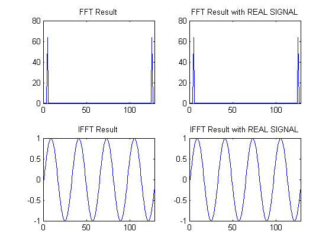
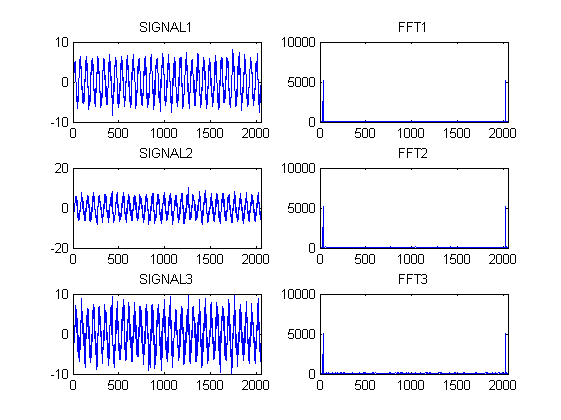
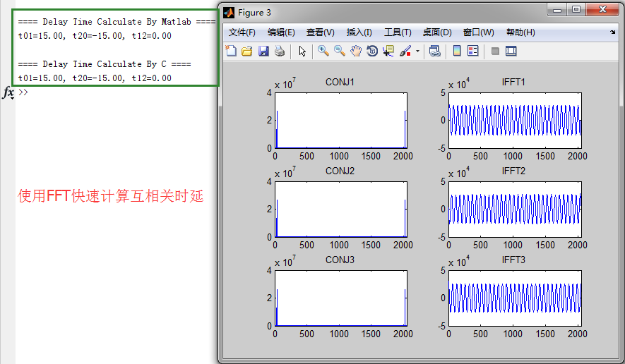

### USE GUIDE:

This project use C language to relize FFT algorithm, and then calculate 
cross-correlation by FFT. Use FFT to calculate cross-correlation will 
improve the performance from O(N^2) to O(n*log(n))

Fllow steps to use this projects:

1. make
2. make run
3. open matlab and run plot_result.m

### UPDATES

1. Add and test function @fft_real and @ifft_real for Real Input Signal, In 2014.04.15
2. Replace @cos and @sin from <math.h> bu using 2 tables, In 2014.04.15

### AUTHOR:

xiahouzuoxin@163.com

2014-04-09
